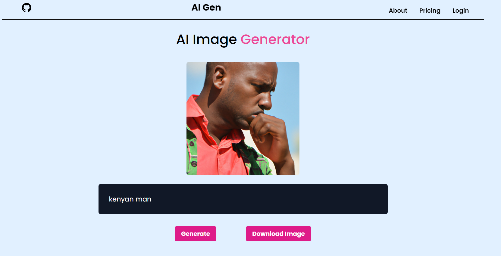

# AI Gen

AI Gen is a project designed to harness the power of OpenAI to generate images, audio, and more using advanced artificial intelligence models.

## Features

- **AI Image Generation:** Generate images using advanced AI models provided by OpenAI.
- **Speech To Text:** Convert real-time audio speech into text dynamically.
- **Text Summarization:** Summarize large amounts of text into a concise summary.

- *More features to be added in the future.* - Audio Generation, Text-to-speech, user Auth, Dark Mode / Light mode

## Demo




## Getting Started

To get started with AI Gen, follow these steps:

1. **Clone the Repository:**

   ```
   git clone https://github.com/preston176/ai-gen.git
   ```


2. **Install Dependencies:**

```
cd ai-gen
npm install
```

3. **Set Up Environment Variables:**
- Obtain an API key from OpenAI and set it in your environment variables.
- Refer to [OpenAI](https://platform.openai.com/api-keys) docs on procedure on how to get an API key.
- Create a `.env` and include your API key with the same format as `.env.example`

4. **Run the Application:**
`npm run dev` or `npm start`

## Usage

1. **Image Generation:**
- Navigate to the image generation feature in the application.
- Click on `Get Started`
- Enter a description of the image you want to generate.
- Click the `Generate` button to create the image using AI.
- To save the generated image, click `Download`

## Contributing

Contributions to AI Gen are welcome! If you'd like to contribute, please follow these steps:

1. Fork the repository.
2. Create a new branch (`git checkout -b feature/your-feature-name`).
3. Commit your changes (`git commit -am 'Add new feature'`).
4. Push to the branch (`git push origin feature/your-feature-name`).
5. Create a new Pull Request. Provide a detailed description of your changes, why they are necessary.

## License

This project is licensed under the MIT License - see the [LICENSE](LICENSE) file for details.

## Acknowledgements

- Special thanks to [OpenAI](https://platform.openai.com/) for providing the powerful AI models used in this project.
